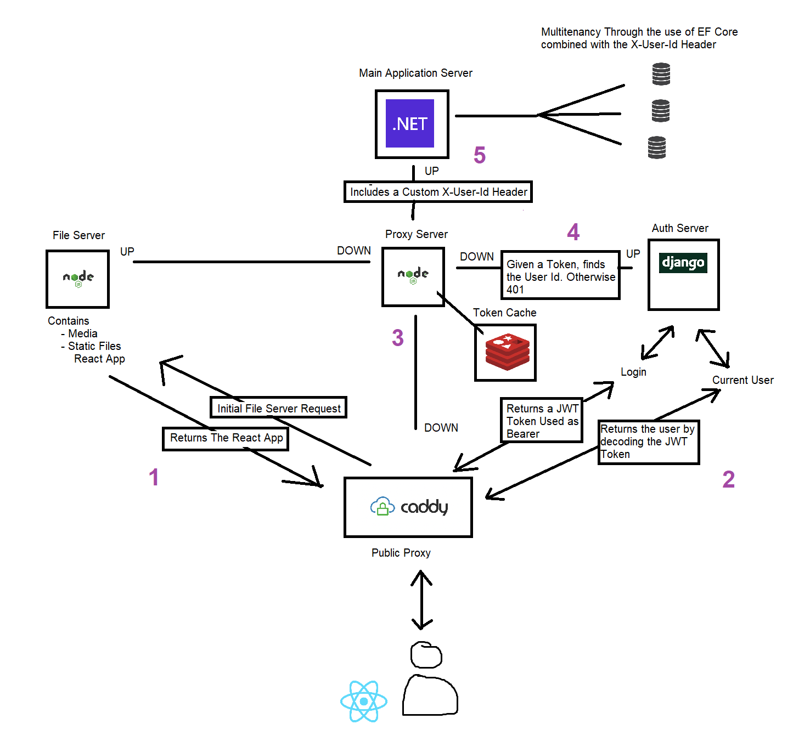

# Order Display System Microservice

## Table of Contents
1. [.Net Backend Documentation](#Net-Backend-Documentation)
2. [A High Level View](#A-High-Level-View)
3. [Docker Detials](#Docker-Detials)
4. [Node Middle Proxy Details](#Node-Middle-Proxy-Details)
5. [Image Upload Details](#Image-Upload-Details)

## .Net Backend Documentation
The documentation for the main application can be found at https://github.com/m-7ard/Dotnet-React-Order-Display-System-

## Setup
### Using Docker
```bash
    >> docker compose up 
```

### Manually (Dev mode)
```bash
    >> dev-start.bat
```
NOTE: The dev version will not use the Caddy proxy

## A High Level View


## Docker Detials
The application uses a docker compose to orchestrate all the servers and uses a bridge network.
The .Net API is private and only accesible through the docker network, preventing the spoofing of the X-User-Id Header.
There is 1 app-related volume, for the fileserver, used to store media such as uploaded images.

## Node Middle Proxy Details
The Node proxy will receive all requests to the .Net & Logout requests. (Except when logging out) It will always first try to confirm that the user is authenticated, by first looking through the token cache in Redis, and then look at the remote Auth server and try to obtain the token from there (which includes the user id), and then cache it in the Redis cache with a TTL dicated by the expiry date of the token. If both the lookups fail, a 401 status is returned.

## Image Upload Details
Image upload go through the proxy, which will then forward the request to the file server, which when successful in saving the images, will return a response with the urls and generated filenames for the saved images and then send a request over to the .Net server to persist "Draft Images" that will be used as a sort of "available image" pool at the time of product image creation.
